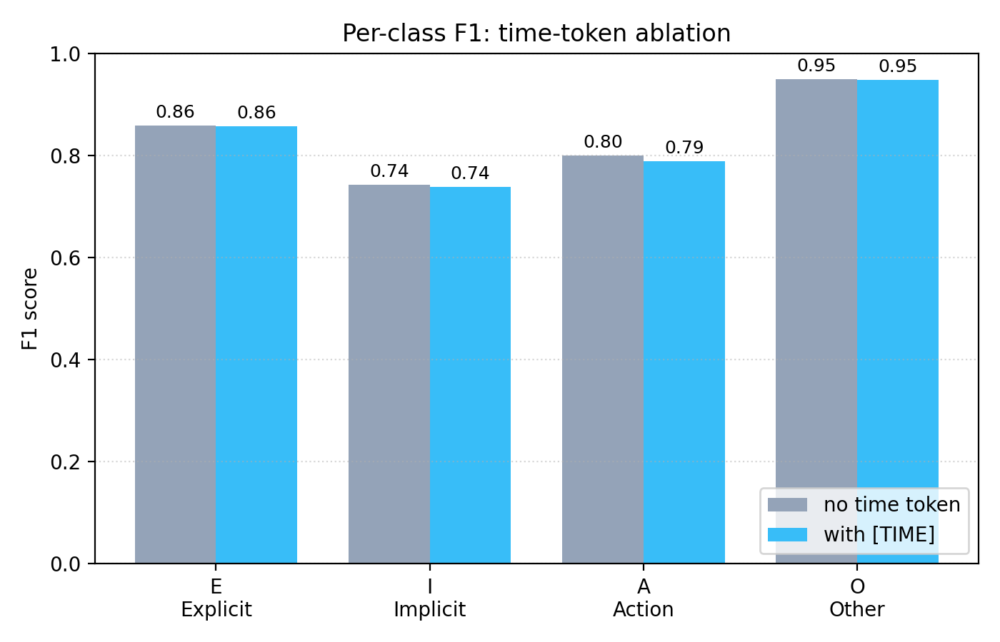
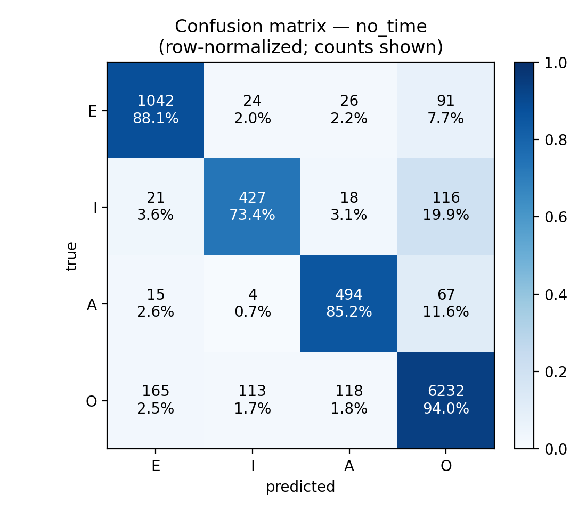
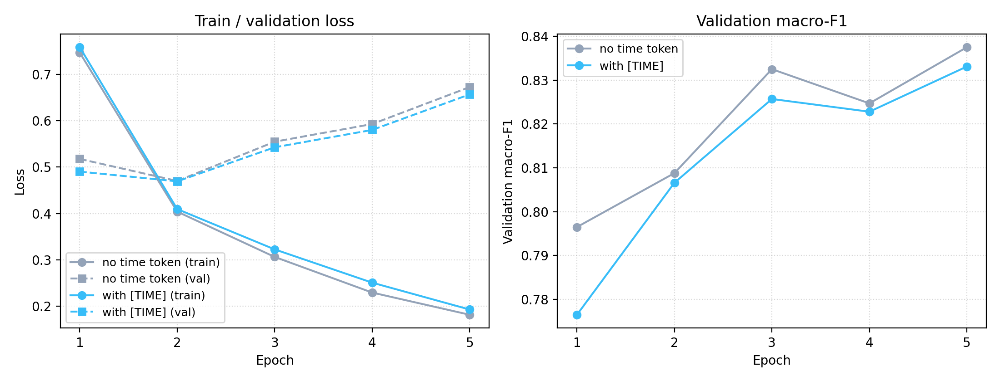
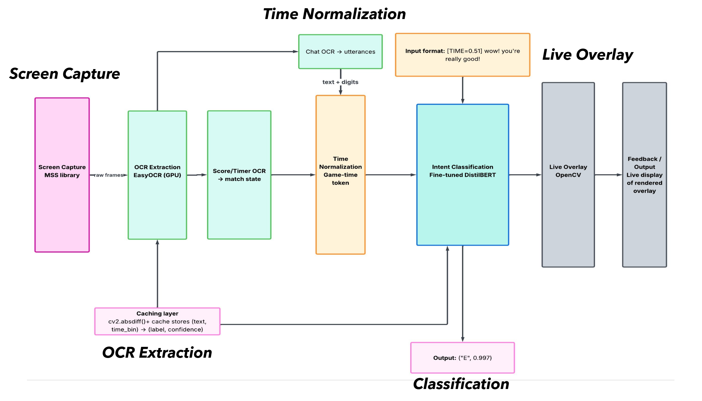

# In-Game Chat Toxicity Intent Classification

Real-time, utterance-level toxicity and intent classification for live game chat: a
DistilBERT classifier fine-tuned on the CONDA dataset of Dota 2 match chat, wired to a
screen-capture → OCR → transparent-overlay pipeline that runs on a live VALORANT window.

**Headline result:** macro-F1 **0.8375** / UCA **0.9133** on the CONDA validation set with
intent-level supervision only — within ~0.8 UCA points of the dual-task JointBERT baseline
from the original CONDA paper. A controlled ablation of normalised game-time conditioning
produced a small but consistent **negative** result across all four classes; the analysis of
*why* is the most interesting part of this repo.

---

## The problem

In-game chat is dominated by ordinary messages. Toxicity is rare, and the rarest categories
are the ones that matter most — implicit toxicity is easy to miss and easy for a naive model
to ignore entirely. A classifier that predicts "not toxic" for everything scores 74% accuracy
on this data and is useless.

That shapes every decision below.

## Dataset

[**CONDA**](https://github.com/usydnlp/CONDA) — Weld et al., *CONDA: a CONtextual
Dual-Annotated dataset for in-game toxicity understanding and detection*, Findings of
ACL-IJCNLP 2021.

- 44,869 English utterances across 1,921 completed Dota 2 matches
- Dual-annotated at utterance and token level; this project uses **utterance-level intent
  only** (single-task)
- Official 60/20/20 split: 26,921 train / 8,973 validation / 8,974 test. The test labels are
  withheld, so **all numbers below are validation-set numbers.**

### Labels

| Label | Meaning | Example |
|---|---|---|
| `E` | Explicit toxicity | "ur trash noob report" |
| `I` | Implicit toxicity | "not a good pudg" |
| `A` | Action | "pausing", "gg reporting" |
| `O` | Other / neutral | "push top", "nice" |

The token-level slot labels (toxicity word, game slang, character name, Dota term, pronoun,
other) are not used.

### Class distribution — training split

| Class | Count | Share | Loss weight |
|---|---:|---:|---:|
| `A` | 1,719 | 6.4% | 3.915 |
| `E` | 3,528 | 13.1% | 1.907 |
| `I` | 1,692 | 6.3% | 3.977 |
| `O` | 19,982 | 74.2% | 0.337 |
| **Total** | **26,921** | | |

Weights are `total / (num_classes × class_count)`, applied to the cross-entropy loss so the
two minority toxicity classes are not drowned out by `O`. Class weighting is the *entire*
imbalance strategy — no oversampling, no augmentation. That is deliberate: the point of
comparison is JointBERT trained on CONDA as released, and resampling would change the
training distribution, making any difference impossible to attribute cleanly.

### Preprocessing

Seven of ten columns are dropped; `utterance`, `chatTime` and `intentClass` are kept. Then:

1. **Time normalisation.** `chatTime` is signed seconds (negative = pre-game lobby). Clipped
   to `[-90, 3600]`, then min-max scaled to `[0, 1]`.
2. **`[SEPA]` removal**, so each row is a self-contained utterance.
3. **Duplicate handling.** Duplicates on `(utterance, chatTime)` are flagged but kept — short
   repeated phrases ("GG WP", ":D", "?") are real game behaviour, not data errors.
4. **NaN handling.** One NaN utterance in the validation split dropped.
5. **Label validation.** All labels verified to lie in `{A, E, I, O}`.

The dataset is **not redistributed here** — see [Setup](#setup).

## Model

`distilbert-base-cased`, fine-tuned for 4-way sequence classification. Cased is deliberate:
`EZ`, `GG` and all-caps carry sentiment that lowercasing destroys.

| | |
|---|---|
| Max sequence length | 64 tokens |
| Batch size | 32 |
| Learning rate | 2e-5 |
| Epochs | 5 |
| Schedule | Linear with 10% warmup |
| Optimizer | AdamW |
| Gradient clipping | max-norm 1.0 |
| Loss | Weighted cross-entropy (above) |
| Seed | 42 |

64 tokens sits above the data: mean utterance length is 17.2 WordPiece tokens, observed max
53, so truncation touches roughly the longest 1–2% of utterances.

### The game-time ablation

Two variants, identical except for the input format:

- **no-time** — raw utterance (this is the headline model)
- **with-time** — `[TIME=x.xx]` prepended, e.g. `[TIME=0.84] not a good pudg, report him`

The hypothesis was that because the live pipeline classifies utterances one at a time, it
loses the conversational context a dual-task model can exploit, and a match-time scalar might
partly substitute for it — Märtens et al. (2015) having shown that Dota 2 toxicity clusters
around in-game events rather than spreading uniformly.

## Results

Reported as **macro-F1** rather than accuracy: with 74% of the data in one class, accuracy
(UCA) is dominated by `O` and overstates performance. UCA is included because the CONDA paper
reports it.

| Model | UCA | Macro-F1 | F1 `E` | F1 `I` | F1 `A` | F1 `O` |
|---|---:|---:|---:|---:|---:|---:|
| JointBERT (Weld et al. 2021)\* | 0.921 | n/a | 0.872 | 0.768 | 0.800 | 0.954 |
| **DistilBERT, no time** | **0.9133** | **0.8375** | **0.8590** | **0.7426** | **0.7994** | **0.9490** |
| DistilBERT, with `[TIME]` | 0.9112 | 0.8331 | 0.8573 | 0.7388 | 0.7884 | 0.9480 |

\* JointBERT numbers are from the held-out CONDA **test** set (labels not public); mine are
from the **validation** set, so the comparison is indicative, not strictly apples-to-apples.



Three things worth noting:

1. **Single-task is competitive with dual-task.** JointBERT gets both intent labels *and*
   token-level slot labels in training. This model gets intent only, and lands within 0.8 UCA
   points: `F1[A]` is effectively tied (0.7994 vs 0.800), `F1[O]` within 0.5 points, `F1[E]`
   within 1.3. The largest gap is `F1[I]` (2.5 points) — the hardest class for both. For a
   deployment pipeline, where slot annotations don't exist at inference time anyway, the
   simpler architecture is the right call.
2. **The game-time token does not help.** Every metric is worse with the prefix: UCA −0.21 pts,
   macro-F1 −0.44 pts, per-class −0.17 (`E`), −0.38 (`I`), −1.10 (`A`), −0.10 (`O`). Small,
   but consistent in direction across all four classes.
3. **The damage lands on the rare classes.** `A` and `I` move most, which fits — they have the
   least redundancy in their lexical signal and so the least tolerance for added noise.

### Confusion matrix

No-time model, validation set. Rows are true labels, columns predictions.

|  | pred `E` | pred `I` | pred `A` | pred `O` | total |
|---|---:|---:|---:|---:|---:|
| **true `E`** | 1042 | 24 | 26 | 91 | 1183 |
| **true `I`** | 21 | **427** | 18 | **116** | 582 |
| **true `A`** | 15 | 4 | 494 | 67 | 580 |
| **true `O`** | 165 | 113 | 118 | 6232 | 6628 |



Two failure modes dominate, and the first is the one that matters:

- **`I` → `O` leakage: 116 / 582 = 20%.** One in five implicit-toxicity utterances is read as
  ordinary chat. By definition implicit toxicity lacks the obscenity that flags `E`; its
  surface form is often indistinguishable from neutral talk. "not a good pudg", "wtf are you
  doing" — humans label these from context, not vocabulary. This is the failure mode the CONDA
  authors identified, and the one the time token was meant to help with. It didn't.
- **`A` → `O` leakage: 67 / 580 = 12%.** Action calls ("pause, line crossed", "gg reporting")
  overlap with ordinary coordination talk and get absorbed into the dominant class.

`E` is the cleanest category — only ~12% of true `E` misclassified.

### Training dynamics



Training loss falls smoothly (~0.75 → ~0.19 over 5 epochs). Validation loss bottoms out at
epoch 2 then *rises* (~0.47 → ~0.65) while validation macro-F1 keeps improving. The likely
reading: the model grows over-confident on examples it already gets right (pushing loss up)
while still flipping rare-class examples from wrong to right (pushing F1 up). Selecting on
macro-F1 rather than loss is therefore correct here — but it does mean training sits right at
the edge, and a longer schedule would probably start costing F1 too.

### Why the time token failed

Five candidate mechanisms, in rough order of how much they matter:

1. **CONDA's labels are content-conditional, not time-conditional.** This is the real answer.
   Of 258 utterance texts repeated five or more times in the training split, 232 (89.9%) carry
   a single label on ≥90% of occurrences. The utterances whose meaning *should* shift with match
   time don't shift at all: "gg" is labelled `O` on 1376 of 1378 occurrences, "gg wp" on 277 of
   277, "?" on 343 of 343, ":D" on 120 of 120. Binning `chatTime` into six equal-width
   intervals, `P(O | bin)` stays inside `[0.727, 0.760]` against a marginal of 0.742, and mean
   KL divergence from the marginal is **0.006 bits**. A chi-squared test rejects independence at
   p = 1.2 × 10⁻³⁸, but with N = 26,914 that reflects sample size, not effect size. **No
   engineering refinement of a time feature can recover information the annotators never
   conditioned on.**
2. **Subword fragmentation.** `[TIME]` was never registered as a special token, so WordPiece
   shatters the prefix into `[`, `time`, `=`, `0`, `.`, `8`, `4`, `]`. The model has to
   reassemble a temporal signal across many positions and digit-subword embeddings that were
   never pre-trained on numeric scalars.
3. **Tokenisation waste.** The prefix eats ~7 of 64 tokens — real budget, for utterances near
   the cap.
4. **Redundancy with lexical signal.** At macro-F1 ~0.84 the lexical cues are already strong
   (obscenity → `E`; "smoke", "rotate" → `A`), leaving little margin for a temporal feature.
5. **A match-time scalar may encode the wrong thing.** Märtens et al. found toxicity spikes are
   *event*-triggered (post-death, post-team-fight). A normalised value in `[0, 1]` can't capture
   an event-triggered spike unless events happen on a predictable clock, which they don't.

The honest framing: a subword-fragmented match-time scalar does not improve utterance-level
intent classification **on CONDA**. The broader hypothesis — that some temporal or event-based
conditioning could help — is not refuted by this experiment, because this dataset can't test it.

The supporting analysis lives in [`analysis/label_time_independence/`](analysis/label_time_independence/).

## Live pipeline

```
game window → screen capture → frame diff → ROI extract → OCR → classifier → overlay
```

This part is **built and runs end to end** on a live VALORANT window.

| Stage | What it does |
|---|---|
| Screen capture | `mss` grabs the primary monitor at native resolution, every tick |
| Frame differencing | `cv2.absdiff` on the chat ROI; OCR is skipped entirely when mean per-pixel difference < 0.5. The chatbox is static most frames, so this is the main cost saver |
| ROI extraction | Four hand-coded ROIs in `src/game_info.json` — chat, round timer, won-side score, lost-side score. Chat is upscaled, greyscaled and inverted; numeric ROIs binary-thresholded at 50 |
| OCR | EasyOCR on the chat region; numeric ROIs read with a digit allowlist. Speaker names stripped by splitting on the first colon |
| Time reconstruction | `(completed_rounds × 100) + (100 − round_seconds)`, then normalised with the same min-max bounds as training |
| Match-state caching | Round/score re-read at most every 8 s on success, 2 s cooldown after a parse failure |
| Prediction cache | Memoised on `(utterance, rounded_time_bin)`, so a chat line on screen for many frames is classified once |
| Classification | Softmax over the four classes; records `argmax` label and confidence, e.g. `E 0.74` |
| Overlay | Transparent Tkinter window drawing coloured boxes per chat line — `E` red, `I` orange, `A` yellow, `O` green |



Note the domain mismatch, which is real and untested: the model is trained on **Dota 2** chat
and deployed on **VALORANT**. Shared slang ("gg", "ez", "noob") should transfer; hero/agent
names, items and callouts will not.

## Setup

```bash
pip install -r requirements.txt
```

The live pipeline additionally needs [Tesseract](https://github.com/tesseract-ocr/tesseract)
installed; `src/ocr/capture_screen.py` looks for it at
`C:\Program Files\Tesseract-OCR\tesseract.exe`.

**Data.** Download the three CSVs from the
[CONDA repository](https://github.com/usydnlp/CONDA), run
`model_tuning/preprocessing.ipynb`, and place the outputs in
`model_tuning/data/processed/` as `CONDA_train_cleaned.csv`,
`CONDA_valid_cleaned.csv` and `CONDA_test_cleaned.csv`.

**Train.**

```bash
python model_tuning/train_no_time.py   # headline model → checkpoints/best_model_no_time
python model_tuning/model.py           # with-[TIME] variant → checkpoints/best_model
```

**Evaluate.**

```bash
python src/model/evaluate_no_time.py   # → src/model/results/metrics_no_time.json
python src/model/evaluate.py           # → src/model/results/metrics_with_time.json
python src/model/plot_results.py       # comparison table + plots
```

Checkpoints and metrics are written under `src/model/results/`, which is gitignored — a
checkpoint is ~263 MB.

**Run live.**

```bash
python -m src.pipeline
```

Requires a trained `best_model` checkpoint and ROIs in `src/game_info.json` matching your
resolution and game UI.

## Layout

```
model_tuning/
  model.py                 training loop, with-[TIME] variant
  train_no_time.py         training loop, no-time variant (headline model)
  preprocessing.ipynb      cleaning and split preparation
  data_visualizing.py      label distribution and exploratory plots
  slide_charts.py          figure generation
src/
  pipeline.py              live capture → OCR → classify → overlay loop
  game_info.json           hand-coded ROI coordinates
  debug_capture.py         ROI/OCR debugging helper
  run_test_cases.py        OCR test-image runner
  ocr/capture_screen.py    capture, frame differencing, ROI extraction, OCR
  model/
    CONDA_dataset.py       torch Dataset; use_time_token toggles the ablation
    toxicity_classifier.py inference wrapper for the pipeline
    evaluate.py            eval + metrics JSON, with-[TIME]
    evaluate_no_time.py    eval + metrics JSON, no-time
    plot_results.py        comparison table and per-class/confusion plots
    plot_training_curves.py
  visualization/overlay.py transparent Tkinter overlay
analysis/
  label_time_independence/ the label-vs-time independence study
logs/                      training and evaluation run logs
paper/                     write-up, figures, bibliography
presentations/             slide assets and project report
```

## What I would do differently

**Multi-seed evaluation, first.** Every number here comes from a single run at seed 42. Three
seeds with mean ± std and a paired test on per-example correctness is the difference between a
result and an anecdote, and it's cheap. I should have built it in from the start rather than
treating it as future work.

**I would have checked whether the labels could support the hypothesis before building the
feature.** The time-token ablation was well-executed and answered the wrong question. Twenty
minutes computing `P(label | time bin)` on the training split — which is exactly the analysis I
eventually ran to *explain* the negative result — would have shown up front that CONDA's labels
are essentially time-invariant. The honest lesson is to interrogate the label-generating process
before engineering a feature that depends on it.

**Register `[TIME]` as a real special token.** If I ran the ablation again I'd add it with
`tokenizer.add_tokens(...)` + `model.resize_token_embeddings(...)`, and condition on
event-proximity features (time-since-last-death, time-since-team-fight) rather than a global
clock — closer to what Märtens et al. actually found. On the original CONDA labels this would
most likely reproduce the same negative result; it's worth running against re-annotated labels.

**Quantify OCR error propagation.** The weakest link in the deployed system is unmeasured. The
classifier is evaluated on clean text while the pipeline feeds it EasyOCR output with character
substitutions and segmentation errors. Perturbing the validation set at 5/10/20% character
corruption would characterise end-to-end robustness, and is the contribution most relevant to
anyone actually deploying this.

**Build a held-out VALORANT set.** Training on Dota 2 and deploying on VALORANT is the kind of
domain gap that's easy to wave at and hard to defend without numbers.

Also honest about: validation-only evaluation (CONDA's test labels are withheld), no
cased-vs-uncased ablation, VALORANT-specific time arithmetic that doesn't port to a continuous
match clock, pixel-bound ROIs that break on a resolution change, coarse 15-second sleep
handling for bomb-plant and half-time freezes, and unmeasured train/deploy shift from words the
game client auto-filters before they ever reach the chat UI.

## Citation

```bibtex
@inproceedings{weld-etal-2021-conda,
    title     = "{CONDA}: a {CON}textual Dual-Annotated dataset for in-game toxicity understanding and detection",
    author    = "Weld, Henry and Huang, Guanghao and Lee, Jean and Zhang, Tongshu and
                 Wang, Kunze and Guo, Xinghong and Long, Siqu and Poon, Josiah and Han, Caren",
    booktitle = "Findings of the Association for Computational Linguistics: ACL-IJCNLP 2021",
    month     = aug,
    year      = "2021",
    address   = "Online",
    publisher = "Association for Computational Linguistics",
    doi       = "10.18653/v1/2021.findings-acl.213",
    pages     = "2406--2416"
}
```

Also referenced: Märtens et al., *Toxicity detection in multiplayer online games*, NetGames
2015; Sanh et al., *DistilBERT*, NeurIPS EMC² Workshop 2019; Anti-Defamation League, *Free to
Play?*, 2020.
